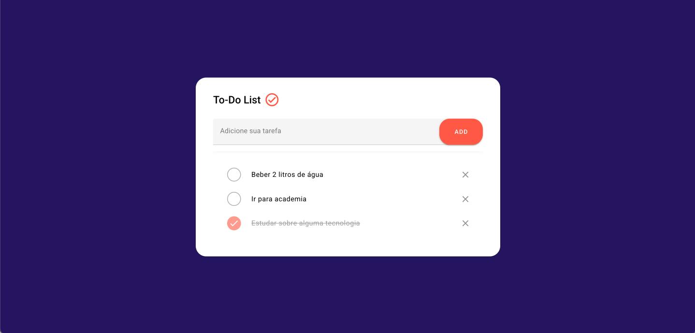

# Aplicativo de Lista de Tarefas Vue

Um aplicativo moderno de Lista de Tarefas construído com Vue 3, TypeScript e Vuetify. Este aplicativo demonstra as boas práticas na organização de componentes.


## Tecnologias Utilizadas

- Vue 3 com Composition API
- TypeScript
- Vuetify 3
- Vite

## Como Começar

### Pré-requisitos

- Node.js (v14 ou superior)
- npm ou yarn

### Instalação

1. Clone o repositório:
```bash
git clone https://github.com/joaovitor8338/to-do-list-vuetify
```

2. Navegue até o diretório do projeto:
```bash
cd to-do-list-vuetify
```

3. Instale as dependências:
```bash
npm install
```

4. Inicie o servidor de desenvolvimento:
```bash
npm run dev
```

O aplicativo estará disponível em `http://localhost:3000`

## Componentes

### TodoApp.vue

O componente principal que orquestra o aplicativo de tarefas. Utiliza o composable `useTasks` para gerenciamento de estado e renderiza os componentes `TaskInput` e `TaskList`.

### TaskInput.vue

Um componente de formulário para adicionar novas tarefas. Recursos:

- Validação de entrada
- Suporte à tecla Enter
- Limpa o input após envio

### TaskList.vue

Exibe a lista de tarefas com os seguintes recursos:
- Checkbox para marcar tarefa como concluída
- Botão de excluir para remover tarefas
- Feedback visual para tarefas concluídas

## Gerenciamento de Estado

O aplicativo usa o composable `useTasks` para gerenciamento de estado, que fornece:

- `newTask`: Valor atual do input
- `tasks`: Array de itens da lista
- `addTask`: Função para adicionar novas tarefas
- `toggleTask`: Função para alternar conclusão da tarefa
- `removeTask`: Função para deletar tarefas

## Screenshot 📷

